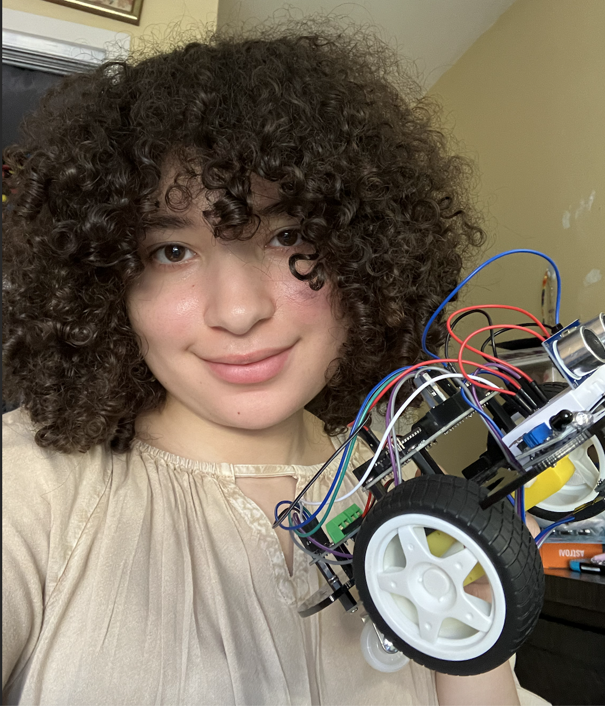

# Line Following Robot

All types of robots are unique with different goals in mind. My original goal was to just have it follow a black line; however, I then came up with another innovative idea by also adding a remote control, which can adjusts the robot's speed as it follows a black line. I'm glad to report: I did just that.   

| **Name** | **School** | **Area of Interest** | **Grade** |
|:--:|:--:|:--:|:--:|
| Allison P | KIPP NYC College Prep | Mechanical Engineering | Incoming Senior


  
# Final Milestone

<iframe width="560" height="315" src="https://www.youtube.com/embed/WOqU2E8lI2k?si=3vnF016dB5lMZfP9" title="YouTube video player" frameborder="0" allow="accelerometer; autoplay; clipboard-write; encrypted-media; gyroscope; picture-in-picture; web-share" referrerpolicy="strict-origin-when-cross-origin" allowfullscreen></iframe>

My final milestone consisted of me coding the robot to be able to adjust its speed as it follows a black line with a remote control. This took me a while to complete due to the robot’s speed never actually adjusting. I kept thinking the answer towards this error was more complicated than it actually was, hence why I took longer than I had anticipated. However, the answer was as simple as the initial speed of the robot being in the void loop () function, causing the robot’s initial speed to become unchangeable. This moment definitely taught me that some solutions are simpler than one may think. During my overall time in this program, I’ve faced a lot of problems and even some doubts that I’ll be able to finish this project, however thanks to perseverance I was taught that anything was possible thanks to hard work and dedication. I hope to take my knowledge from BlueStamp to learn more about coding, so that I’m able to eventually implement that onto my future builds. 


# Second Milestone

<iframe width="560" height="315" src="https://www.youtube.com/embed/o2IOYAsA8n0?si=dx2H_BiItkd1xtwh" title="YouTube video player" frameborder="0" allow="accelerometer; autoplay; clipboard-write; encrypted-media; gyroscope; picture-in-picture; web-share" referrerpolicy="strict-origin-when-cross-origin" allowfullscreen></iframe>


  My second milestone consisted of me finishing wiring and coding my robot to detect a black line along with starting to brainstorm and begin working on adding more innovative ideas onto my build. While I completed the wiring effortlessly, the coding part was where I began going through some issues due to some issues with the analogWrite() functions in my code, which can cause issues with the robot’s sense of directions and motors; in my case, it caused the robot to move backwards rather than forward. However once I’ve noticed this error it became easy to get rid of! Then I’ve moved onto brainstorming new innovative ideas for my build, which led me to the conclusion of adding a remote control so that my robot is able to move at different speeds as it follows a line. Before adding more onto my original code, I decided to test if the wiring and coding for the remote control was accurate by creating a separate code that solely focuses on the robot’s ability to move based on given instructions from the remote control. Luckily, this went along smoothly and for my third milestone, as said previously, I hope to combine both previous codes to create a line following robot that can adjust its speed once instructed to by the remote control. 


# First Milestone

<iframe width="560" height="315" src="https://www.youtube.com/embed/rwWfh26CdAY?si=LXISGsjKZZFyQUD3" title="YouTube video player" frameborder="0" allow="accelerometer; autoplay; clipboard-write; encrypted-media; gyroscope; picture-in-picture; web-share" referrerpolicy="strict-origin-when-cross-origin" allowfullscreen></iframe>

  My first milestone was assembling my build and running a test code in order to certify that the robot was able to move. However before completing my actual build, I’ve done a slight simple practice with coding the LED to light on and off to obtain a bit of a reminder and just a better overall understanding of the Arduino and breadboard. In terms of assembling the robot, I had to improvise a bit due to the screws and standoffs' sizes not aligning with the video tutorial I used to assemble my robot, however it did end up working despite the sizes slightly differing from the video. My test code consists of a loop where my robot moves in all of the same directions on repeat. While, the robot is currently able to move in all directions, it currently can't follow a black line. My current future goals are to focus on coding the robot to follow a black line and to brainstorm more unique and new innovated ideas to add onto my build. 

# Schematics 

Official Schematics.png

# Code

```c++
#include <IRremote.h>

const int IR_RECEIVE_PIN = 12;  // Define the pin number for the IR Sensor

const int A_1B = 5;
const int A_1A = 6;
const int B_1B = 9;
const int B_1A = 10;

 int speed = 150;

const int lineTrack = 2;
 
void setup() {
  Serial.begin(9600);

  //motor
  pinMode(A_1B, OUTPUT);
  pinMode(A_1A, OUTPUT);
  pinMode(B_1B, OUTPUT);
  pinMode(B_1A, OUTPUT);
  //line track
  pinMode(lineTrack, INPUT);

//IR remote
  IrReceiver.begin(IR_RECEIVE_PIN, ENABLE_LED_FEEDBACK);  // Start the IR receiver // Start the receiver
  Serial.println("REMOTE CONTROL START");
  }

void loop() {

  int lineColor = digitalRead(lineTrack); // 0:white  1:black
  // Serial.println(lineColor); // Has error 
  if (lineColor) {
    moveLeft(speed);
  } else {
    moveRight(speed);
  }

if (IrReceiver.decode()) {
    //    Serial.println(results.value,HEX);
    String key = decodeKeyValue(IrReceiver.decodedIRData.command);
    if (key != "ERROR") {
      Serial.println(key);

      if (key == "+") {
        speed += 20;
      } else if (key == "-") {
        speed -= 20;
      }

      if (speed >= 255) {
        speed = 255;
      }
      if (speed <= 0) {
        speed = 0;
      }
     
    }
    IrReceiver.resume();  // Enable receiving of the next value
  }
  }

void moveLeft(int speed) {
  analogWrite(A_1B, speed);
  analogWrite(A_1A, 0);
  analogWrite(B_1B, 0);
  analogWrite(B_1A, 0);
}

void moveRight(int speed) {
  analogWrite(A_1B, 0);
  analogWrite(A_1A, 0);
  analogWrite(B_1B, speed);
  analogWrite(B_1A, 0);
}

void stopMove() {
  analogWrite(A_1B, 0);
  analogWrite(A_1A, 0);
  analogWrite(B_1B, 0);
  analogWrite(B_1A, 0);
}

 String decodeKeyValue(long result)
{
  switch(result){
    case 0x16:
      return "0";
    case 0xC:
      return "1"; 
    case 0x18:
      return "2"; 
    case 0x5E:
      return "3"; 
    case 0x8:
      return "4"; 
    case 0x1C:
      return "5"; 
    case 0x5A:
      return "6"; 
    case 0x42:
      return "7"; 
    case 0x52:
      return "8"; 
    case 0x4A:
      return "9"; 
    case 0x9:
      return "+"; 
    case 0x15:
      return "-"; 
    case 0x7:
      return "EQ"; 
    case 0xD:
      return "U/SD";
    case 0x19:
      return "CYCLE";         
    case 0x44:
      return "PLAY/PAUSE";   
    case 0x43:
      return "FORWARD";   
    case 0x40:
      return "BACKWARD";   
    case 0x45:
      return "POWER";   
    case 0x47:
      return "MUTE";   
    case 0x46:
      return "MODE";       
    case 0x0:
      return "ERROR";   
    default :
      return "ERROR";
    }
}
```

# Bill of Materials

| **Part** | **Note** | **Price** | **Link** |
|:--:|:--:|:--:|:--:|
| SunFounder Ultimate Starter Kit | Main Build | $69.99 | <https://www.amazon.com/SunFounder-Compatible-Tutorials-Including-Controller/dp/B0B778L1DZ/ref=sr_1_1?crid=3JQTX3SPFIY9Z&dib=eyJ2IjoiMSJ9.D9LrCZJnua_keVMLJz2FWi87-vYq5Z0c0hghVjdTqVV5SxTVgutlUut8NIgJpkDha5RIUUEOd8ZL_9-liu4TuIX3Y5c9E3mrmlKMD_2d9cnuKu55yBqRD35FcNSR2oUIVkT7byKksfuqXVAx34A8gUuPMYKaM3Jepu1QA3uOutR5sR0O3bugifITwp4OocPwYE4ZDNZaCae7Y3Ydd5zuneo_8PLiYwbdyVH9QvcGEwg.-iuZvwFJywFFRggszeNpXLuAEE8nPtLKbqmhVUOfLc0&dib_tag=se&keywords=sunfounder+3+in+1+starter+kit+for+arduino+uno&qid=1718980379&sprefix=3+in+1+ard%2Caps%2C120&sr=8-1">  </a> |

# Other Resources/Examples
- [Line Following Guide](https://docs.sunfounder.com/projects/3in1-kit-v2/en/latest/car_project/car_line_track.html)
- [Remote Control Guide](https://docs.sunfounder.com/projects/3in1-kit-v2/en/latest/car_project/car_remote_control.html)

